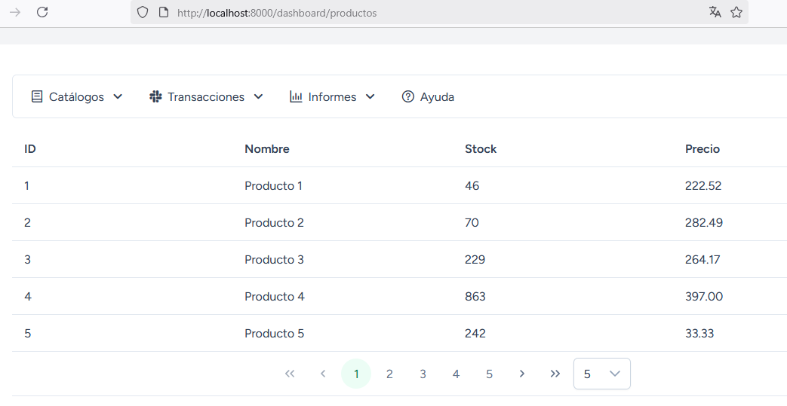

# AXIOS

## Paso 1. Modificar el archivo appVue.js para integrar axios

```javascript
import { createApp } from 'vue';
import App from './components/App3.vue';
// código omitido
import axios from 'axios'

const app = createApp(App);

app.config.globalProperties.$axios = axios;
window.axios = axios;

// código omitido
app.mount('#app');
```
### Notas
* `app.config.globalProperties.$axios = axios;` crea una propiedad global llamada `$axios` para ser utilizada en entorno de Vue. Se utiliza cuando en los componentes trabajamos con **Options API** y se utilizará de esta manera `this.$axios.get(...)...`  
* **window.axios = axios;** Crea una propiedad para ser utilizada en entornos diferentes de Vue. En la práctica estamos utilizando `axios`, la variable definida en `window.axios`.
* Pero he probado y no se necesita ninguna de estas configuraciones en el proyecto porque el proyecto ya está utilizando `bootstrap` este incluye una configuración para usar `axios`.  

El archivo de configuración de bootstrap es el siguiente:  

**resources\js\bootstrap.js**  

```javascript
import axios from 'axios';
window.axios = axios;

window.axios.defaults.headers.common['X-Requested-With'] = 'XMLHttpRequest';
```
Entonces, en `appVue.js` podría NO incluir instrucciones para utilizar `axios`. Solo será necesario `app.config.globalProperties.$axios = axios;` si va a utilizar `Options API` en sus diseños creados con `vue`.  

## Paso 2. Crear un componente de vue

**resources\js\components\ProductoComponent.vue**  

### CASO 1  
:pushpin: Nota. Este ejemplo es con **Options API** y una función normal para ejecutar para ejecutar la petición con `this.$axios`. Cuando se utiliza una `función normal` no se puede acceder a `this` dentro de la aplicación de `axios`.  Por esta razón fue necesario crear una variable `me` para guardar la referencia a `this` y poder acceder a las variables definidas en `data()`.   

```javascript
<template>
    <div class="card">
        <DataTable :value="products" paginator :rows="5" :rowsPerPageOptions="[5, 10, 20, 50]" tableStyle="min-width: 50rem">
            <Column field="id" header="ID" style="width: 25%"></Column>
            <Column field="nombre" header="Nombre" style="width: 25%"></Column>
            <Column field="stock" header="Stock" style="width: 25%"></Column>
            <Column field="precio" header="Precio" style="width: 25%"></Column>
        </DataTable>
    </div>
</template>
<script>

import { ref } from 'vue';
import DataTable from 'primevue/datatable';
import Column from 'primevue/column';

export default {
  data(){
    return{
      products : [],
    }
  },
  components: {       
    DataTable,
    Column,  
  },
  mounted() {
    this.getProductos()
  },
  methods: {
    async getProductos(){
      let me = this;
      this.$axios.get("/api/dashboard/productos").then(function (response){
          me.products = response.data
      }).catch(function (error){
        console.log(error);
      });
    }
  },
};
</script>
```

### CASO 2  
:pushpin: Nota. Este ejemplo es con **Options API** y una `función flecha` para ejecutar para ejecutar la petición con `this.$axios`. Cuando se utiliza una `función flecha` se puede acceder a `this` dentro de la petición de `axios`.   

```javascript
<template>
    <div class="card">
        <DataTable :value="products" paginator :rows="5" :rowsPerPageOptions="[5, 10, 20, 50]" tableStyle="min-width: 50rem">
            <Column field="id" header="ID" style="width: 25%"></Column>
            <Column field="nombre" header="Nombre" style="width: 25%"></Column>
            <Column field="stock" header="Stock" style="width: 25%"></Column>
            <Column field="precio" header="Precio" style="width: 25%"></Column>
        </DataTable>
    </div>
</template>
<script>

import { ref } from 'vue';
import DataTable from 'primevue/datatable';
import Column from 'primevue/column';

export default {
  data(){
    return{
      products : [],
    }
  },
  components: {       
    DataTable,
    Column,  
  },
  mounted() {
    this.getProductos()
  },
  methods: {
    async getProductos(){
      this.$axios.get("/api/dashboard/productos").then((response) => {
          this.products = response.data
      }).catch(function (error){
        console.log(error);
      });
    }
  },
};
</script>
```

### CASO 3  
:pushpin: Nota. Este ejemplo es con **Composition API** para ejecutar la petición con `axios`.  

```javascript
<template>
    <div class="card">
        <DataTable :value="products" paginator :rows="5" :rowsPerPageOptions="[5, 10, 20, 50]" tableStyle="min-width: 50rem">
            <Column field="id" header="ID" style="width: 25%"></Column>
            <Column field="nombre" header="Nombre" style="width: 25%"></Column>
            <Column field="stock" header="Stock" style="width: 25%"></Column>
            <Column field="precio" header="Precio" style="width: 25%"></Column>
        </DataTable>
    </div>
</template>
<script setup>

import { ref, onMounted } from 'vue';

import DataTable from 'primevue/datatable';
import Column from 'primevue/column';

const products = ref([]);

onMounted(() => {
  getProductos();
});

const getProductos = async () => {
  try {
    const response = await axios.get("/api/dashboard/productos");
    products.value = response.data
  } catch (err) {
    console.error(err);
  }
};

</script>
```  

### Resultado

Nota. Los 3 ejemplos presentados arriba generan el mismo resultado.  

  