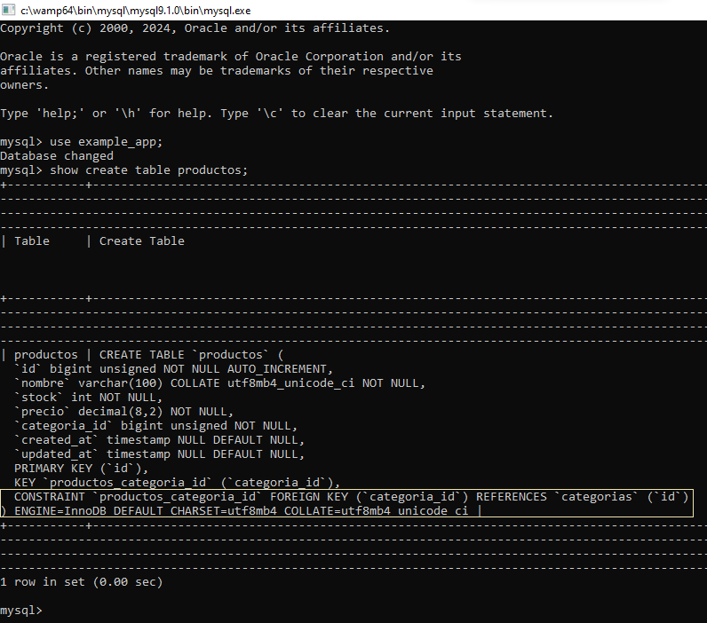

# Base de datos

:books: Las migraciones predeterminadas del proyecto de Laravel ya fueron ejecutadas con el comando `php artisan migrate`.  

## Comentarios acerca de las migraciones.  

### Ejemplos de migraciones

`database\migrations\2025_05_18_113438_create_categorias_table.php`  

```php
<?php

use Illuminate\Database\Migrations\Migration;
use Illuminate\Database\Schema\Blueprint;
use Illuminate\Support\Facades\Schema;

return new class extends Migration
{
    /**
     * Run the migrations.
     */
    public function up(): void
    {
        Schema::create('categorias', function (Blueprint $table) {
            $table->id();
            $table->string("nombre",100);
            $table->timestamps();
        });
    }

    /**
     * Reverse the migrations.
     */
    public function down(): void
    {
        Schema::dropIfExists('categorias');
    }
};
```  

`database\migrations\2025_05_18_142457_create_productos_table.php`  

```php
<?php

use Illuminate\Database\Migrations\Migration;
use Illuminate\Database\Schema\Blueprint;
use Illuminate\Support\Facades\Schema;

return new class extends Migration
{
    /**
     * Run the migrations.
     */
    public function up(): void
    {
        Schema::create('productos', function (Blueprint $table) {
            $table->id();
            $table->string("nombre",100);
            $table->integer("stock");
            $table->decimal('precio', total: 8, places: 2);
            $table->foreignId('categoria_id')->constrained(
                table: 'categorias', indexName: 'productos_categoria_id'
            );
            $table->timestamps();
        });
    }

    /**
     * Reverse the migrations.
     */
    public function down(): void
    {
        Schema::dropIfExists('productos');
    }
};
```  

:books: A pesar de la relación entre las tablas `cateogorias` y `productos`, cuando se ejecutan las migraciones, la definición de las tablas no tienen la restricción. Por lo tanto, se puede ingresar un producto aún cuando `categoria_id` no tenga un valor equivalente en la tabla de `categorias`. La razón es que por defecto, el proyecto de Laravel no tiene definido en `engine` o motor de bases de datos.  

  

## 

```php
<?php

use Illuminate\Support\Str;

return [

    // comentarios omitidos

    'default' => env('DB_CONNECTION', 'sqlite'),

    // comentarios omitidos

    'connections' => [

      // configuraciones omitidas

        'mysql' => [
            'driver' => 'mysql',
            'url' => env('DB_URL'),
            'host' => env('DB_HOST', '127.0.0.1'),
            'port' => env('DB_PORT', '3306'),
            'database' => env('DB_DATABASE', 'laravel'),
            'username' => env('DB_USERNAME', 'root'),
            'password' => env('DB_PASSWORD', ''),
            'unix_socket' => env('DB_SOCKET', ''),
            'charset' => env('DB_CHARSET', 'utf8mb4'),
            'collation' => env('DB_COLLATION', 'utf8mb4_unicode_ci'),
            'prefix' => '',
            'prefix_indexes' => true,
            'strict' => true,
            'engine' => null,
            'options' => extension_loaded('pdo_mysql') ? array_filter([
                PDO::MYSQL_ATTR_SSL_CA => env('MYSQL_ATTR_SSL_CA'),
            ]) : [],
        ],

      // configuraciones omitidas

    ],

];
```
:warning: El comportamiento expuesto se debe a la siguiente configuración `'engine' => null,`. No se ha especificado el `motor de almacenamiento` para la base de datos. Los motores típicos son `MyISAM` e `InnoDB`. Por defecto se utiliza el motor de almacenamiento `MyISAM` y este motor exige las restricciones.

## Especificar el motor de almacenamiento.

```php
<?php

use Illuminate\Support\Str;

return [

    // comentarios omitidos

    'default' => env('DB_CONNECTION', 'sqlite'),

    // comentarios omitidos

    'connections' => [

      // configuraciones omitidas

        'mysql' => [
            'driver' => 'mysql',
            'url' => env('DB_URL'),
            'host' => env('DB_HOST', '127.0.0.1'),
            'port' => env('DB_PORT', '3306'),
            'database' => env('DB_DATABASE', 'laravel'),
            'username' => env('DB_USERNAME', 'root'),
            'password' => env('DB_PASSWORD', ''),
            'unix_socket' => env('DB_SOCKET', ''),
            'charset' => env('DB_CHARSET', 'utf8mb4'),
            'collation' => env('DB_COLLATION', 'utf8mb4_unicode_ci'),
            'prefix' => '',
            'prefix_indexes' => true,
            'strict' => true,
            'engine' => 'InnoDB',
            'options' => extension_loaded('pdo_mysql') ? array_filter([
                PDO::MYSQL_ATTR_SSL_CA => env('MYSQL_ATTR_SSL_CA'),
            ]) : [],
        ],

      // configuraciones omitidas

    ],

];
```

:warning: Ahora la configuración se ha cambiado de `null` a `InnoDB` en `'engine' => null,`. 

## Ejecutar las migraciones.

Si ahora ejecuta las migraciones, ya tendrá las restricciones entre las tablas `caterogias` y `productos`

  

Observe la línea siguiente:  
**CONSTRAINT `productos_categoria_id` FOREIGN KEY (`categoria_id`) REFERENCES `categorias` (`id`)**  