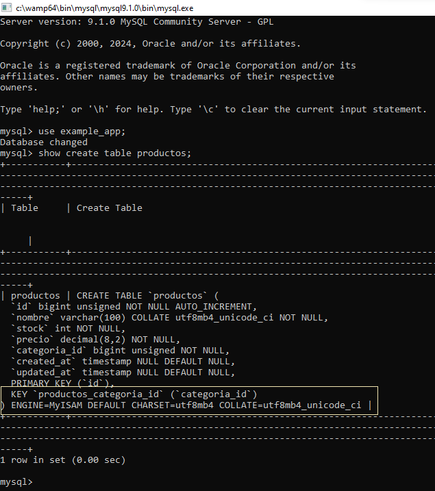

# Base de datos

:books: Las migraciones predeterminadas del proyecto de Laravel ya fueron ejecutadas con el comando `php artisan migrate`.  

## Crear las migraciones

:pushpin: Es importante seguir un formato estándar a la hora de nombrar la migración para que se cree de forma conveniente. Me refiero a usar nombres como `createCategoriasTable` y `createProductosTable`. Creo que también se pueden usar nombres como `create_categorias_table`  y  `create_productos_table`.  

## Definir las migraciones.

Nota. Se pretende mostrar cómo crear tablas relacionadas.  

#### Forma 1:

:pushpin: Esta forma necesita que se cree el campo y luego se defina la llave foránea.  

```php
Schema::table('posts', function (Blueprint $table) {
    $table->unsignedBigInteger('user_id');
    $table->foreign('user_id')->references('id')->on('users');
});
```
#### Forma 2:  

##### Forma 2.a:  

```php
Schema::table('posts', function (Blueprint $table) {
    $table->foreignId('user_id')->constrained();
});
```

* Con esta sintaxis se crea automáticamente un campo en la tabla hija que servirá para relacionar ambas tablas.
* También se crea un índice basado en el campo que creó y la la restricción entre ambas tablas (references...)   
* Se basa en la idea de que los nombres de las tablas y los nombres de los campos siguen un estándar en su escritura. Por ejemplo, en `$table->foreignId('user_id')->constrained();` se está usando el campo `user_id`. Laravel ya sabe que debe crear una relación con la tabla llamada `users` (en plural). 
* DESVENTAJA `Los nombres son pluralizados basados en el inglés, no en español`. Por ejemplo: `user` se pluraliza como `users`, pero los nombres en espaplo no siempre se pluralizan de forma correcta.  
* Recuerdo que este comportamiento se puede cambiar, pero no intentaré por el momento documentarlo aquí.  

:star: Por suerte, tenemos otra alternativa que he documentado como `Forma 2.b` por cuestiones de referencia.  

##### Forma 2.b:  
```php
Schema::table('posts', function (Blueprint $table) {
    $table->foreignId('user_id')->constrained(
        table: 'users', indexName: 'posts_user_id'
    );
});
```

## Definir la migración para la tabla categorias (tabla padre)

Comando: `php artisan make:migration createCategoriasTable
`

Archivo creado: `database\migrations\2025_05_18_113438_create_categorias_table.php`  

El contenido de `public function up(): void{...}` ha sido digitado para definir la estructura que tendrá la tabla `categorias`  

```php
<?php

use Illuminate\Database\Migrations\Migration;
use Illuminate\Database\Schema\Blueprint;
use Illuminate\Support\Facades\Schema;

return new class extends Migration
{
    /**
     * Run the migrations.
     */
    public function up(): void
    {
        Schema::create('categorias', function (Blueprint $table) {
            $table->id();
            $table->string("nombre",100);
            $table->timestamps();
        });
    }

    /**
     * Reverse the migrations.
     */
    public function down(): void
    {
        Schema::dropIfExists('categorias');
    }
};
```  

## Definir la migración para la tabla productos (tabla hija)

:books: Se ha utilizado la segunda forma explicada arriba.  

Comando: `php artisan make:migration createProductosTable`  

Archivo creado:  `database\migrations\2025_05_18_142457_create_productos_table.php`  

El contenido de `public function up(): void{...}` ha sido digitado para definir la estructura que tendrá la tabla `productos`  

```php
<?php

use Illuminate\Database\Migrations\Migration;
use Illuminate\Database\Schema\Blueprint;
use Illuminate\Support\Facades\Schema;

return new class extends Migration
{
    /**
     * Run the migrations.
     */
    public function up(): void
    {
        Schema::create('productos', function (Blueprint $table) {
            $table->id();
            $table->string("nombre",100);
            $table->integer("stock");
            $table->decimal('precio', total: 8, places: 2);
            $table->foreignId('categoria_id')->constrained(
                table: 'categorias', indexName: 'productos_categoria_id'
            );
            $table->timestamps();
        });
    }

    /**
     * Reverse the migrations.
     */
    public function down(): void
    {
        Schema::dropIfExists('productos');
    }
};
```  

:books: A pesar de la relación entre las tablas `cateogorias` y `productos`, cuando se ejecutan las migraciones, la definición de las tablas no tienen la restricción. Por lo tanto, se puede ingresar un producto aún cuando `categoria_id` no tenga un valor equivalente en la tabla de `categorias`. La razón es que por defecto, el proyecto de Laravel no tiene definido el motor de almacenamiento de las bases de datos `engine`.  

  

Observe las líneas resaltadas con un borde de color amarillo. No existe la relación con la tabla `categorias` y se está utilizando el motor de almacenamiento `MyISAM`      

```php
<?php

use Illuminate\Support\Str;

return [

    // comentarios omitidos

    'default' => env('DB_CONNECTION', 'sqlite'),

    // comentarios omitidos

    'connections' => [

      // configuraciones omitidas

        'mysql' => [
            'driver' => 'mysql',
            'url' => env('DB_URL'),
            'host' => env('DB_HOST', '127.0.0.1'),
            'port' => env('DB_PORT', '3306'),
            'database' => env('DB_DATABASE', 'laravel'),
            'username' => env('DB_USERNAME', 'root'),
            'password' => env('DB_PASSWORD', ''),
            'unix_socket' => env('DB_SOCKET', ''),
            'charset' => env('DB_CHARSET', 'utf8mb4'),
            'collation' => env('DB_COLLATION', 'utf8mb4_unicode_ci'),
            'prefix' => '',
            'prefix_indexes' => true,
            'strict' => true,
            'engine' => null,
            'options' => extension_loaded('pdo_mysql') ? array_filter([
                PDO::MYSQL_ATTR_SSL_CA => env('MYSQL_ATTR_SSL_CA'),
            ]) : [],
        ],

      // configuraciones omitidas

    ],

];
```
:warning: El comportamiento expuesto se debe a la siguiente configuración `'engine' => null,`. No se ha especificado el `motor de almacenamiento` para la base de datos. Los motores típicos son `MyISAM` e `InnoDB`. Por defecto se utiliza el motor de almacenamiento `MyISAM` y este motor exige las restricciones.

## Especificar el motor de almacenamiento.

```php
<?php

use Illuminate\Support\Str;

return [

    // comentarios omitidos

    'default' => env('DB_CONNECTION', 'sqlite'),

    // comentarios omitidos

    'connections' => [

      // configuraciones omitidas

        'mysql' => [
            'driver' => 'mysql',
            'url' => env('DB_URL'),
            'host' => env('DB_HOST', '127.0.0.1'),
            'port' => env('DB_PORT', '3306'),
            'database' => env('DB_DATABASE', 'laravel'),
            'username' => env('DB_USERNAME', 'root'),
            'password' => env('DB_PASSWORD', ''),
            'unix_socket' => env('DB_SOCKET', ''),
            'charset' => env('DB_CHARSET', 'utf8mb4'),
            'collation' => env('DB_COLLATION', 'utf8mb4_unicode_ci'),
            'prefix' => '',
            'prefix_indexes' => true,
            'strict' => true,
            'engine' => 'InnoDB',
            'options' => extension_loaded('pdo_mysql') ? array_filter([
                PDO::MYSQL_ATTR_SSL_CA => env('MYSQL_ATTR_SSL_CA'),
            ]) : [],
        ],

      // configuraciones omitidas

    ],

];
```

Observe las líneas resaltadas con un borde de color amarillo.   

:warning: Ahora la configuración se ha cambiado de `null` a `InnoDB` en `'engine' => null,`. 

## Ejecutar las migraciones.

Si ahora ejecuta las migraciones, ya tendrá las restricciones entre las tablas `caterogias` y `productos`

  

Observe las líneas resaltadas con un borde de color amarillo. Ahora sí existe la relación con la tabla `categorias` y se está utilizando el motor de almacenamiento `InnoDB`    
