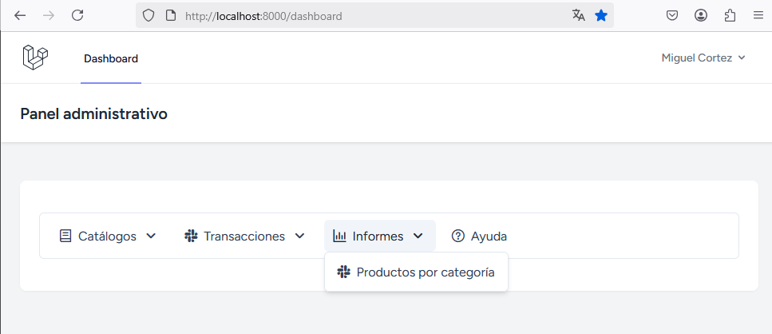
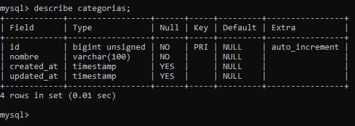
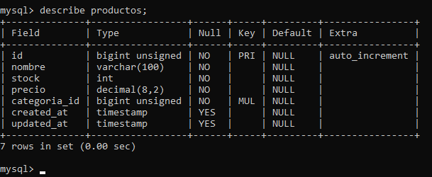
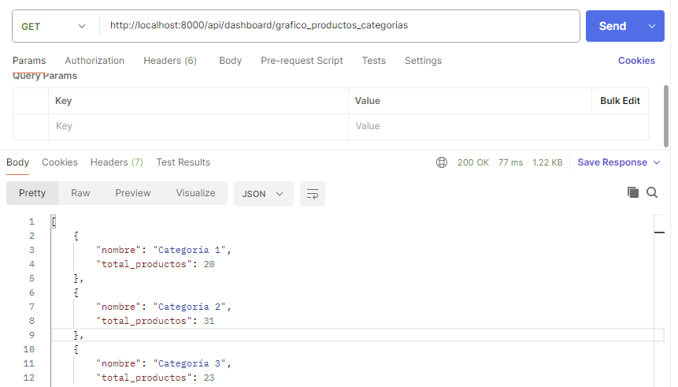
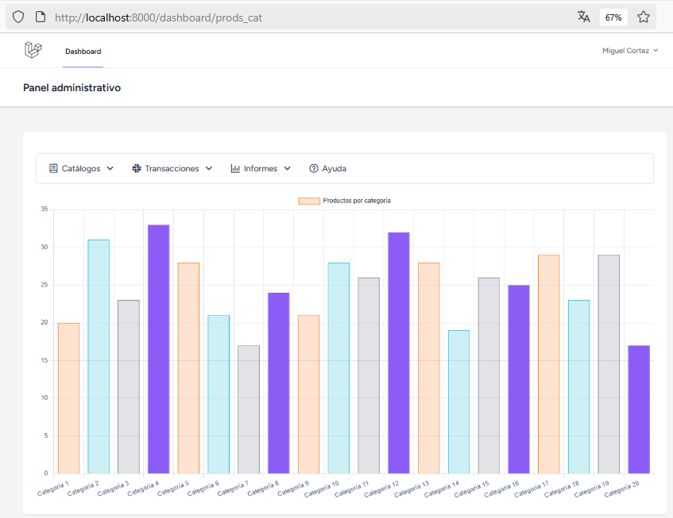
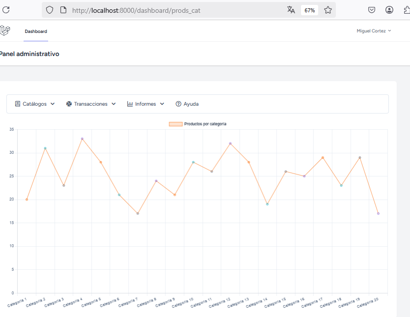

# Creación de gráficos con chart.js (Primevue)

## Paso 1. Instalar chart.js
```
npm install chart.js
```

## Paso 2. Crear un componente de Vue.

En este componente se pegar el código necesario para mostrar un gráfico con datos estáticos (tomado de Primevue)

Compoente creado: `resources\js\components\GraficoTotalProductosCategorias.vue`  

### Paso 2.1 Pegar el código de ejemplo en el componente recien creado.


[Ejemplo de gráfico de barras](https://primevue.org/chart/#chartjs)

Este es el código del ejemplo:  

```javascript
<template>
    <div class="card">
        <Chart type="bar" :data="chartData" :options="chartOptions" />
    </div>
</template>

<script setup>
import { ref, onMounted } from "vue";

onMounted(() => {
    chartData.value = setChartData();
    chartOptions.value = setChartOptions();
});

const chartData = ref();
const chartOptions = ref();

const setChartData = () => {
    return {
        labels: ['Q1', 'Q2', 'Q3', 'Q4'],
        datasets: [
            {
                label: 'Sales',
                data: [540, 325, 702, 620],
                backgroundColor: ['rgba(249, 115, 22, 0.2)', 'rgba(6, 182, 212, 0.2)', 'rgb(107, 114, 128, 0.2)', 'rgba(139, 92, 246 0.2)'],
                borderColor: ['rgb(249, 115, 22)', 'rgb(6, 182, 212)', 'rgb(107, 114, 128)', 'rgb(139, 92, 246)'],
                borderWidth: 1
            }
        ]
    };
};
const setChartOptions = () => {
    const documentStyle = getComputedStyle(document.documentElement);
    const textColor = documentStyle.getPropertyValue('--p-text-color');
    const textColorSecondary = documentStyle.getPropertyValue('--p-text-muted-color');
    const surfaceBorder = documentStyle.getPropertyValue('--p-content-border-color');

    return {
        plugins: {
            legend: {
                labels: {
                    color: textColor
                }
            }
        },
        scales: {
            x: {
                ticks: {
                    color: textColorSecondary
                },
                grid: {
                    color: surfaceBorder
                }
            },
            y: {
                beginAtZero: true,
                ticks: {
                    color: textColorSecondary
                },
                grid: {
                    color: surfaceBorder
                }
            }
        }
    };
}
</script>
```
### Paso 2.2 Importar Chart en el componente  
:star: Abajo de la línea  
```import { ref, onMounted } from "vue";```  

 agregue una nueva importación 
 
 ```import Chart from 'primevue/chart';```   

## Paso 3 Crear una ruta de vue-router.

En mi proyecto, las rutas de `vue-router` las estoy creando en el archivo `resources\js\router\index.js`  

```javascript
import { createRouter, createWebHistory } from 'vue-router';
// código omitido
import ProdsCat from '../components/GraficoTotalProductosCategorias.vue';
const routes = [
    // código omitido
    { path: '/dashboard/prods_cat', component: ProdsCat }
];

const router = createRouter({
    history: createWebHistory(),
    routes,
});

export default router;
```
## Paso 4 Agregar una opción en el menú

En mi proyecto, el menú está definido en `resources\js\components\App.vue`  

* Esta opción de menú se usará para acceder al gráfico.
* Cuando el usuario haga clic en la opción del menú `Productos por categoría` se llamará a la ruta `/dashboard/prods_cat` que que fue definida en 
`resources\js\router\index.js`  

```javascript
<template>
    <div class="card py-4">
        <Menubar :model="items">
            <template #item="{ item, props, hasSubmenu }">
            // código omitido
            </template>
        </Menubar>
    </div>
    <router-view></router-view>
</template>
<script setup>
import { ref } from "vue";
import { useRouter } from 'vue-router';
import Menubar from 'primevue/menubar';

const router = useRouter();

const items = ref([
    // código omitido
    ,
    {
        label: 'Informes',
        icon: 'pi pi-chart-bar',
        items: [
            {
                icon: 'pi pi-slack',
                label: 'Productos por categoría',
                route: '/dashboard/prods_cat',
            },
        ]
    },
    // código omitido.
]);
</script>

<style scoped>

</style>
```

:beetle: Comentar que inicialmente había dejado `url` en lugar de `route` en la línea `route: '/dashboard/prods_cat',`, entonces, la página cargaba por completo. Es decir, como si no estuviera utilizando `vue-router`.

## Paso 5. Ejecutar la aplicación y mostrar el informe

En este paso se va a ejecutar la aplicación para mostrar el informe con los datos estáticos (ejemplo original tomado de Primevue)

```
npm run dev
```

```
php artisan serve
```

Acceda al navegador web: `http:localhost:8000`  

Opción de menú para acceder al gráfico: `Informes > Productos por categoría` 

  

Vista del gráfico con datos estáticos:  
  


## Paso 6. Modificar el código de ejemplo.

:star: En este paso vamos a hacer una petión a la base de datos con `axios` para obtener los datos que serán mostrados en el gráfico y se modificará el código del ejemplo para que utilice los datos obtenidos desde la base de datos en lugar de usar los datos estáticos.

:pushpin: Como información extra, presento la estructura de las tablas usadas en el ejemplo:  
### Tabla: categorias

  

### Tabla: productos

  

**A continuación presento cómo quedará el código del componente `resources\js\components\GraficoTotalProductosCategorias.vue` ya modificado (CÓDIGO COMPLETO)**:  

```javascript
<template>
    <div class="card">
        <Chart type="bar" :data="chartData" :options="chartOptions" />
    </div>
</template>

<script setup>
import { ref, onMounted } from "vue";
import Chart from 'primevue/chart';
onMounted(() => {
    getCategorias()
});

const chartData = ref();
const chartOptions = ref();
const etiquetas = ref([])
const valores = ref([])

const setChartData = () => {
    return {
        labels: etiquetas,
        datasets: [
            {
                label: 'Productos por categoría',
                data: valores.value,
                backgroundColor: ['rgba(249, 115, 22, 0.2)', 'rgba(6, 182, 212, 0.2)', 'rgb(107, 114, 128, 0.2)', 'rgba(139, 92, 246 0.2)'],
                borderColor: ['rgb(249, 115, 22)', 'rgb(6, 182, 212)', 'rgb(107, 114, 128)', 'rgb(139, 92, 246)'],
                borderWidth: 1
            }
        ]
    };
};
const setChartOptions = () => {
    const documentStyle = getComputedStyle(document.documentElement);
    const textColor = documentStyle.getPropertyValue('--p-text-color');
    const textColorSecondary = documentStyle.getPropertyValue('--p-text-muted-color');
    const surfaceBorder = documentStyle.getPropertyValue('--p-content-border-color');

    return {
        plugins: {
            legend: {
                labels: {
                    color: textColor
                }
            }
        },
        scales: {
            x: {
                ticks: {
                    color: textColorSecondary
                },
                grid: {
                    color: surfaceBorder
                }
            },
            y: {
                beginAtZero: true,
                ticks: {
                    color: textColorSecondary
                },
                grid: {
                    color: surfaceBorder
                }
            }
        }
    };
}
const getCategorias = async () => {
  try {
    await axios.get("/api/dashboard/grafico_productos_categorias")
    .then(function (response) {
        response.data.forEach((item, index) => {
            etiquetas.value.push(item.nombre)
            valores.value.push(parseInt(item.total_productos))
        });
    })
    .catch(function (error) {
        console.log(error);
    })
    .finally(function () {
        chartData.value = setChartData();
        chartOptions.value = setChartOptions();
    });
  } catch (err) {
    console.error(err);
  }
};
</script>
```

:star: En los siguientes literales, destaco los cambios que tiene el código anterior respecto del ejemplo original tomado de Primevue:  

a) Se crearon las variables para almacenar los datos obtenidos desde la base de datos.    
```
const etiquetas = ref([])
const valores = ref([])
```
b) Se creó la función para obtener los datos desde la base datos.  
```
const getCategorias = async () => {
    ...
}
```

c) Se sustituyeron los datos estáticos por los datos dinámicos.  

```javascript
const setChartData = () => {
    return {
        labels: etiquetas, // LINEA MODIFICADA
        datasets: [
            {
                label: 'Productos por categoría', // LINEA MODIFICADA
                data: valores.value, // LINEA MODIFICADA
                // código omitido
            }
        ]
    };
};
```

d) Se modificón la función `onMounted` para que ejecute solamente la función `getCategorias()`  

```javascript
onMounted(() => {
    getCategorias()
});
```

El código que originalmente estaba en `onMounted()` se llevó para el bloque `finally` de la petición realizadas con `axios`. Esto se hizo para que las etiquetas y los datos del gráfico sean asignados después de haber finalizado la carga de los datos.  

## Paso 7. Crear una ruta API

Esta ruta se crea en el archivo `routes\api.php`  

```php
<?php

use Illuminate\Http\Request;
use Illuminate\Support\Facades\Route;
use App\Http\Controllers\CategoriaController;
// código omitido
Route::get('/dashboard/grafico_productos_categorias', [CategoriaController::class, 'getData']);
```

## Paso 8 (OPCIONAL). Probar la ruta desde Postman:  

  

## Paso 9. Ejecutar la aplicación

Ejecute la aplicación nuevamente y vea que los datos del gráfico ahora son los que se obtuvieron desde la base de datos.  

  

## Paso 10 (OPCIONAL). Cambiar el tipo de gráfico

Para cambiar el tipo de gráfico, solo debe cambiar la palabra `bar` por otro tipo de gráfico permitido en el siguiente bloque de código:  

```javascript
<template>
    <div class="card">
        <Chart type="bar" :data="chartData" :options="chartOptions" />
    </div>
</template>
```
Estas instrucciones las encontrará en el componente `resources\js\components\GraficoTotalProductosCategorias.vue`  

### Tipo: line
Por ejemplo, para que se presente como gráfico de líneas, la configuración debe quedar así:  

```javascript
<template>
    <div class="card">
        <Chart type="line" :data="chartData" :options="chartOptions" />
    </div>
</template>
```
Este sería el resultado:  

  

Según la página oficial de Primevue los tipos de datos permitidos son: pie, doughtnut, line, bar, radar y polarArea.  Pero es necesario comprender que no solo basta con cambiar el tipo de gráfico porque algunos pueden requerir más parámetros.  

Para este ejemplo no funciona el tipo **doughtnut**; pero repito, esto se puede debe a algún otro parámetro, serie de datos, etc.  NO ES que necesariamente no puede funcionar.  

  

### Tipo polarArea:  

  


### :rotating_light: Desafío:  

Los colores de las barras (tanto el fondo como los bordes) están definidos por las siguientes líneas:  

```javascript
backgroundColor: ['rgba(249, 115, 22, 0.2)', 'rgba(6, 182, 212, 0.2)', 'rgb(107, 114, 128, 0.2)', 'rgba(139, 92, 246 0.2)'],
borderColor: ['rgb(249, 115, 22)', 'rgb(6, 182, 212)', 'rgb(107, 114, 128)', 'rgb(139, 92, 246)'],
```

El gráfico riginalmente tenía 4 datos estáticos, por tanto, están definidos 4 colores para el fondo de las barras y 4 colores para los bordes de las barras.  

Entonces, **¿cuál es el desafío?**
Sería conveniente que si cargara 20 categorías, tuviera también 20 colores para el fondo de las barras y 20 colores para los bordes de las barras; si cargara 5 categorías, debería tener 5 colores para el fondo de las barras y 5 colores para los bordes.  