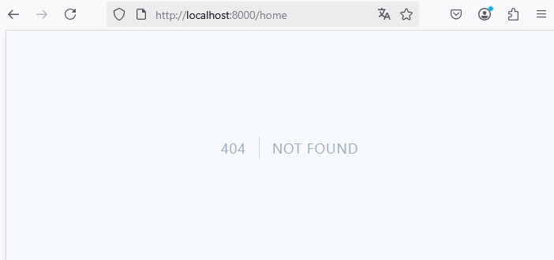

# Middleware

## Contexto

Se pretede crear una ruta web protegida en `routes\web.php` mediante el uso de `Middleware`. Vamos a suponer que la creación copias de seguridad de la base de datos solo estará disponible para algún o algunos usuarios específicos (los que cumplan con los criterios definidos en el middleware).  

## 1. Creación del Middleware

Se creará un middleware con el nombre `BackupAdmin`  

Comando:  

```
php artisan make:middleware BackupAdmin
```

  

Esta es la ruta del archivo creado: `app\Http\Middleware\BackupAdmin.php` y el contenido por defecto del archivo es el siguiente:  

```php
<?php

namespace App\Http\Middleware;

use Closure;
use Illuminate\Http\Request;
use Symfony\Component\HttpFoundation\Response;

class BackupAdmin
{
    /**
     * Handle an incoming request.
     *
     * @param  \Closure(\Illuminate\Http\Request): (\Symfony\Component\HttpFoundation\Response)  $next
     */
    public function handle(Request $request, Closure $next): Response
    {
        return $next($request);
    }
}
```

## 2. Agregar la lógica del Middleware

:guardsman: En el **middleware** podemos agregar cualquier lógica que permita determinar los criterios que nosotros queremos que se cumplan para acceder al recurso de destino. En caso contrario,  vamos a redirigir al usuario a otra vista o ejecutar alguna otra acción.

Cuando las condiciones se hayan superado, el usuario podrá acceder al recurso de destino con el comando `return $next($request)` de la función  `handle` que se encuentra definida en la clase `BackupAdmin`, es decir, en el **middleware**    

Código agregado al middleware:  

:one: Importación  

Para tener acceso a la información de usuario autenticado.  

```php
use Illuminate\Support\Facades\Auth;
```

:two: Modificación de la función `handle`:  

* Para la gestión de roles estoy utilizando `spatie/laravel-permission` y un usuario puede pertenecer a múltiples roles.
* Pero lo que me interesa es que uno de los roles del usuario sea administrador, en caso contrario, será dirigido a la ruta `/home` 

```php
<?php

namespace App\Http\Middleware;

use Closure;
use Illuminate\Http\Request;
use Symfony\Component\HttpFoundation\Response;
use Illuminate\Support\Facades\Auth;  // LÍNEA AGREGADA
class BackupAdmin
{
    /**
     * Handle an incoming request.
     *
     * @param  \Closure(\Illuminate\Http\Request): (\Symfony\Component\HttpFoundation\Response)  $next
     */
    public function handle(Request $request, Closure $next): Response
    {
      // AGREGUÉ DESDE AQUÍ
        $user = Auth::user();
        $user->getPermissionsViaRoles();
        if ($user->roles[0]->name != "administrador") {
            return redirect('/home');
        }
        // HASTA AQUÍ
        return $next($request);
    }
}
```

## 3. Registrar globalmente el Middleware

Para registrar el nuevo middleware se modifica el archivo `bootstrap\app.php` 

Contenido original del archivo:  

```php
<?php

use Illuminate\Foundation\Application;
use Illuminate\Foundation\Configuration\Exceptions;
use Illuminate\Foundation\Configuration\Middleware;

return Application::configure(basePath: dirname(__DIR__))
    ->withRouting(
        web: __DIR__.'/../routes/web.php',
        api: __DIR__.'/../routes/api.php',
        commands: __DIR__.'/../routes/console.php',
        health: '/up',
    )
    ->withMiddleware(function (Middleware $middleware) {
        //
    })
    ->withExceptions(function (Exceptions $exceptions) {
        //
    })->create();
```

**Modificación** Al archivo `bootstrap\app.php` le agregué dos bloques de código: 

```php
<?php

use Illuminate\Foundation\Application;
use Illuminate\Foundation\Configuration\Exceptions;
use Illuminate\Foundation\Configuration\Middleware;

return Application::configure(basePath: dirname(__DIR__))
    ->withRouting(
        web: __DIR__.'/../routes/web.php',
        api: __DIR__.'/../routes/api.php',
        commands: __DIR__.'/../routes/console.php',
        health: '/up',
    )
    // código omitido

    // AGREGUÉ DESDE AQUÍ

    // Primer bloque
    ->withMiddleware(function (Middleware $middleware) {

        $middleware->append(BackupAdmin::class);

    })

    // Segundo bloque
    ->withMiddleware(function (Middleware $middleware) {
        $middleware->alias(['backup' => BackupAdmin::class]);
    })
    // HASTA AQUÍ
    ->create();
```

:orange_book: El primer bloque, registra el middleware **BackupAdmin**.  

:green_book: El segundo bloque, también registra el middleware; pero además le asigna un **alias** o **sobrenombre** que podrá ser utilizado en la ruta. **NO NECESITA** los dos bloques de código porque son **dos maneras** de hacer básicamente **lo mismo**.  

:construction: **En la práctica**, he observado que se puede usar **BackupAdmin** con solo importarlo en `routes\web.php` (sin registrarlo), **excepto** si se quiere utilizar el **alias**  

## 4. Definiendo la ruta web

Esta ruta se define en el archivo `routes\web.php` 

Lo primero que debemos hacer es importar la clase del Middleware `BackupAdmin` con el siguiente comando:  
```php
use App\Http\Middleware\BackupAdmin;
```


:a: **Utilizando la clase BackupAdmin**  
```php
Route::get("/bk", function(){
    $output = shell_exec("C:/wamp64/bin/mysql/mysql9.1.0/bin/mysqldump -u root example_app > C:/Users/macv/Documents/example_app.sql");
    //echo $output;
    echo "Backup realizado";
})->middleware(['auth', 'verified', BackupAdmin::class])->name('bk');
```

:b: **Utilizando el alias**  

```php
Route::get("/bk", function(){
    $output = shell_exec("C:/wamp64/bin/mysql/mysql9.1.0/bin/mysqldump -u root example_app > C:/Users/macv/Documents/example_app.sql");
    //echo $output;
    echo "Backup realizado";
})->middleware(['auth', 'verified', 'backup'])->name('bk');
```

## 5. Creando el backup

Ejecutar la aplicación y acceder a la ruta `http://localhost:8000/bk` 

  


:warning: En caso que **no se cumplan las condiciones**, se mostrará el contenido de la vista `home`.  Si la vista **home** no existe se mostrará `404 | NOT FOUND` como se ve en la imagen de abajo:  


  

